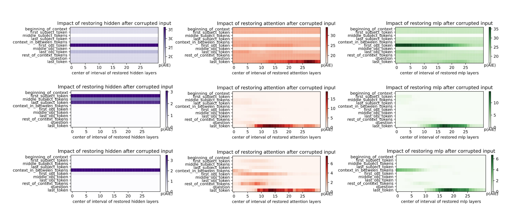

## Visualization of Restoration Experiments

Below is a visualization showing the impact of selectively restoring hidden states, attention layers, and MLP layers after injecting corruption into the model.  
It highlights which token regions are most sensitive to each component during the restoration process.

